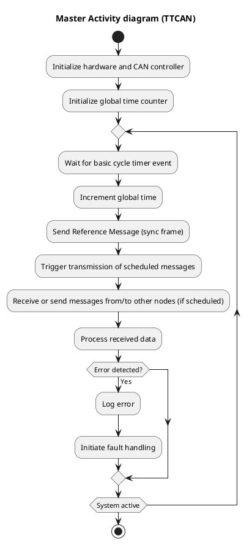

# About this library

This library is written as a way to allow the modules to interact with each other in a deterministic way. The way it achieves the deterministic properties, is by using time triggered CAN bus.

## What is time triggered CAN
A time-triggered CAN-bus (Controller Area Network) is a communication protocol where messages are transmitted at predefined time intervals, rather than being triggered by events or data changes. This library implements this communication protocol.

## Requirements
This library has the following functional requirements:
| Identifier | Description | Moscow|
| --- | --- | --- | 
| F1 | This library must have a mechanism to sync all the nodes on the bus, which runs at a predefined interval of 1 Milliseconds. | Must have|
| F2 | The library must have a mechanism to queue and send data on the queued intervals over the bus. | Must have |
| F3 | The library should have a mechanism that detects sample-loss and tries to recover the lost samples. | Should have |

These are the technical requirements:
| Identifier | Description | Moscow |
| --- | --- | --- |
| T1 | This library is written using the barr-c guideline | Must have |
| T2 | This library is tested with software unit-tests | Must have |
| T3 | This library is tested with continuous integration pipelines | Must have |
| T4 | This library is written platform independent | Must have| 
| T5 | This library does not use any form of dynamic allocations or runtime polymorphism. | Should have|

## CAN Frames
CAN Header always has format (29-bits total length):
```
0 [14-bits of schedule_index] [14-bits of data_slot_id]
```

CAN Normal frame:
```
| HEADER | DLC | DATA |
```

CAN Sync frame:
```
| HEADER | DLC=8| 64-bit Timestamp |
```

## Schedule
The schedule is the basis of the protocol. The exact implementation can be decided by the user, but the following information is required.

Schedule Length - How many entries in one round of the schedule.

Entry Duration - How long (in NTU) each entry in the schedule is alloted. Must be greater than the tranmission time for a single can frame (in NTU).

Schedule Data - The schedule data itself. This does not need to be stored on each node, or anywhere even, however the information from the schedule must be used to generate each node's local schedule. In practice, it may be desirable for every node to have the full schedule.

The schedule can be stored as a series of entries (of length Schedule Length). Each entry contains a node ID and a data ID. For a typical use case, each of these can be encoded as a byte, though for larger networks/data structures, these could be encoded as 2 bytes each. There are 4 types of entries in the schedule:

### Reference message slot

Node ID: 1-7 (depending on which time master is transmitting)

Data ID: 0

A slot for Reference messages to be sent.

### Exclusive message slot

ID: 1 - (2^NUM_ID_BITS)-1 (ID of Node that should transmit in this slot)

DataID: 1 - (2^NUM_DATAID_BITS)-1.

This is the most common entry in the schedule. The Data value is application specific, but allows for nodes to transmit specific information in a specific schedule entry (and thus one node may appear multiple times in the schedule, but with different data values). If all nodes share a common data structure (similar to an Object Dictionary in CANOpen), this number could be an index into that data structure. This can also allow all nodes to act as consumers of the messages as they know which node transmitted and what entry should be updated.

### Arbitration message slot

ID: 2^NUM_ID_BITS

DataID: 2^NUM_DATAID_BITS

This is a "generic" message slot that allows for ad-hoc or on-request messages to be sent by nodes. In the event that multiple nodes wish to transmit an ad-hoc message, CANBus arbitration will determine which node can transmit in this window. IF a node loses arbitration, it can attempt to send again in the next arbitration message slot.

### Free Slot

ID: 0
Data: 0
This is an empty entry in the schedule that allows for the network to be expanded by adding Exclusive/Arbitration messages

It is important to note that only 29 bits are available in the CAN Frame header id field, so NUM_ID_BITS + NUM_DATAID_BITS must be <= 29.


## Sequence diagram



## Scope of this library
This library implements the dtaa-link layer of the Time Triggered CAN protocol. This does not include the physical layer, which is linked through a seperate .h config file, which allows the user of this library to hook this library up to the HAL of the MCU target.